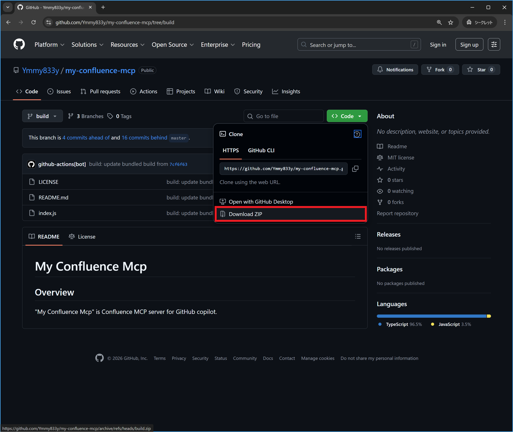
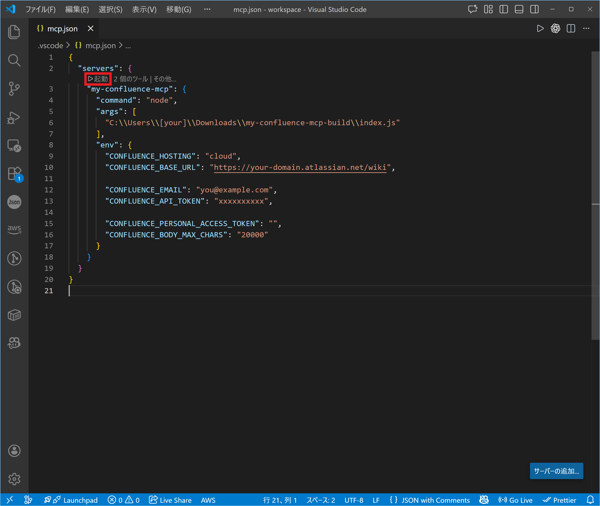

# 操作ガイド

ここでは、**my-confluence-mcp** を「ビルド済み成果物（build ブランチ）」として導入し、**特定プロジェクトに MCP サーバーを追加して使い始めるまで**の手順を説明します。\
実際の使い方については、[機能一覧](./features) を参考にしてください。

（対象：主に **Windows + VS Code + GitHub Copilot** を想定）

---

## 事前準備

- **Node.js がインストール済み**であること（`node -v` が通ること）
- Confluence の接続情報を用意しておくこと
  - Cloud の場合：`CONFLUENCE_EMAIL` + `CONFLUENCE_API_TOKEN`
  - On-prem の場合：`CONFLUENCE_PERSONAL_ACCESS_TOKEN`（PAT）を使うのがおすすめ（環境により異なります）

> [!note]
> `CONFLUENCE_PERSONAL_ACCESS_TOKEN`（PAT）を使う場合は、`CONFLUENCE_EMAIL` / `CONFLUENCE_API_TOKEN` は不要です。  
> PAT を使わない場合は、**`CONFLUENCE_EMAIL` と `CONFLUENCE_API_TOKEN` の両方**が必要です。

---

## 手順

### 1. 配布ファイル（build ブランチ）をダウンロードする

本リポジトリには、簡単にMCPサーバーを起動するための **ビルド済みファイル**が `build` ブランチに用意されています。  
以下へアクセスし、コードをダウンロードしてください。

- https://github.com/Ymmy833y/my-confluence-mcp/tree/build

> 例：GitHub の「Code」ボタンから **Download ZIP** でダウンロード



---

### 2. ダウンロードファイルを展開する

ダウンロードした ZIP を任意のフォルダーに展開します。

例：
- `C:\Users\[your]\Downloads\my-confluence-mcp-build\`

以降の手順では、この展開先にある `index.js` を MCP から起動します。  
（`index.js` の位置は、展開したフォルダー構成に合わせて読み替えてください）

---

### 3. MCP を利用したいプロジェクトに `mcp.json` を用意する

MCP サーバーを追加したいプロジェクト側に、次のファイルを作成（または追記）します。

- `<対象プロジェクト>/.vscode/mcp.json`

---

### 4. `mcp.json` に my-confluence-mcp のサーバー設定を追加する

`.vscode/mcp.json` に以下を追記します。  
※ `args` のパスは **あなたの環境の展開先**に合わせて必ず変更してください。

> [!Tip]
> **Windowsのパス表記について**  
> JSON では `\` をエスケープする必要があるため、`C:\\Users\\...\\index.js` のように書くのが安全です。  
> もしくは `/` 区切り（`C:/Users/.../index.js`）でも動く環境が多いです。

#### 設定例（推奨：バックスラッシュをエスケープ）

```json
{
  "servers": {
    "my-confluence-mcp": {
      "command": "node",
      "args": [
        "C:\\Users\\[your]\\Downloads\\my-confluence-mcp-build\\index.js"
      ],
      "env": {
        "CONFLUENCE_HOSTING": "cloud",
        "CONFLUENCE_BASE_URL": "https://your-domain.atlassian.net/wiki",

        "CONFLUENCE_EMAIL": "you@example.com",
        "CONFLUENCE_API_TOKEN": "xxxxxxxxxx",

        "CONFLUENCE_PERSONAL_ACCESS_TOKEN": "",
        "CONFLUENCE_BODY_MAX_CHARS": "20000",

        "CONFLUENCE_DEFAULT_CQL": "space = SAMPLE AND type = page"
      }
    }
  }
}
```

#### 各項目のポイント

* `CONFLUENCE_HOSTING`

  * `cloud` または `onprem` を指定します。
* `CONFLUENCE_BASE_URL`

  * Cloud 例：`https://your-domain.atlassian.net/wiki`
  * On-prem 例：`https://confluence.example.com`（環境に合わせて）
* 認証（どちらか一方）

  * **PAT を使う場合**：`CONFLUENCE_PERSONAL_ACCESS_TOKEN` を設定（`CONFLUENCE_EMAIL` / `CONFLUENCE_API_TOKEN` は空でもOK）
  * **PAT を使わない場合**：`CONFLUENCE_EMAIL` と `CONFLUENCE_API_TOKEN` を設定
* `CONFLUENCE_BODY_MAX_CHARS`

  * 取得する本文の最大文字数です。ページが長い場合はこの値で切り詰められます。

---

### 5. VS Code 側で設定を読み込ませる（MCP を起動する）

`mcp.json` を保存したら、MCP を起動します。



---

## 動作確認

Copilot Chat（または利用しているAIクライアント）で、例えば以下を試してください。

* 「Confluence で `〇〇` に関するページを検索して」
* 「さっきの検索結果のうち、`△△` のページ内容を取得して要約して」

うまくいけば、Confluence の検索結果やページ本文を元に回答が返ってきます。

> [!IMPORTANT]
> オンプレ環境の場合、REST API のレスポンスが環境（バージョン・設定）により揺れる可能性があります。\
> 詳細については、[オンプレ環境の REST API レスポンス検証](./onprem-api-response-compatibility-checklist) を確認してください。

> [!NOTE]
> **my-confluence-mcp** の基本的な使い方については、[機能一覧](./features) を参考にしてください。

---

## よくあるつまずき（簡易トラブルシュート）

* **Node が見つからない / 起動しない**

  * `node -v` が通るか確認してください。
  * `command` を `node` ではなくフルパスにする必要がある環境もあります。

* **`index.js` のパスが違う**

  * `args` のパスが実在するか確認してください（展開先のフォルダー構造によって変わります）。
  * JSONの `\` エスケープ漏れがあると失敗します（`\\` にする）。

* **認証エラーになる**

  * PAT を使うなら `CONFLUENCE_PERSONAL_ACCESS_TOKEN` を設定（Cloud/On-prem どちらでも、環境が許せAllowしていれば利用可能）
  * PAT を使わないなら `CONFLUENCE_EMAIL` と `CONFLUENCE_API_TOKEN` の両方が必要です。

* **取得できるはずのページが出ない**

  * Confluence 側の閲覧権限の範囲内しか取得できません（トークン/ユーザーの権限を確認してください）。

